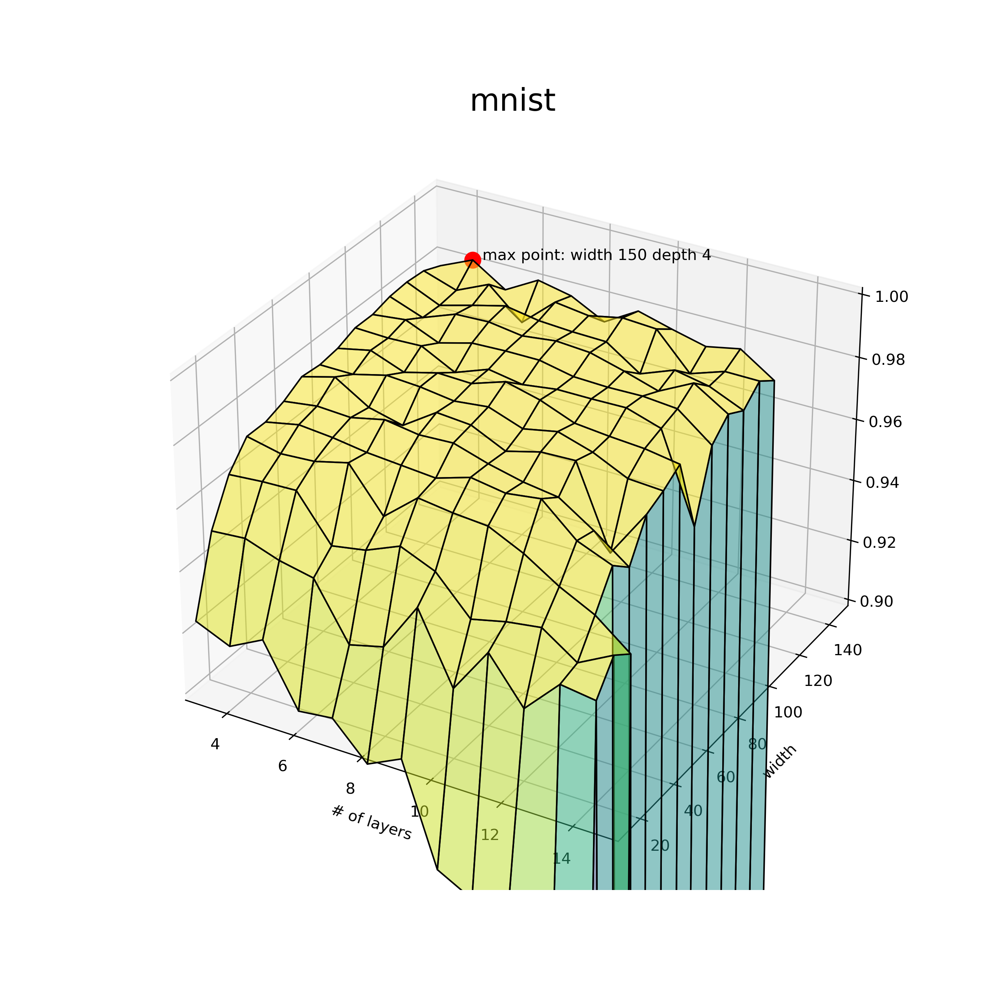
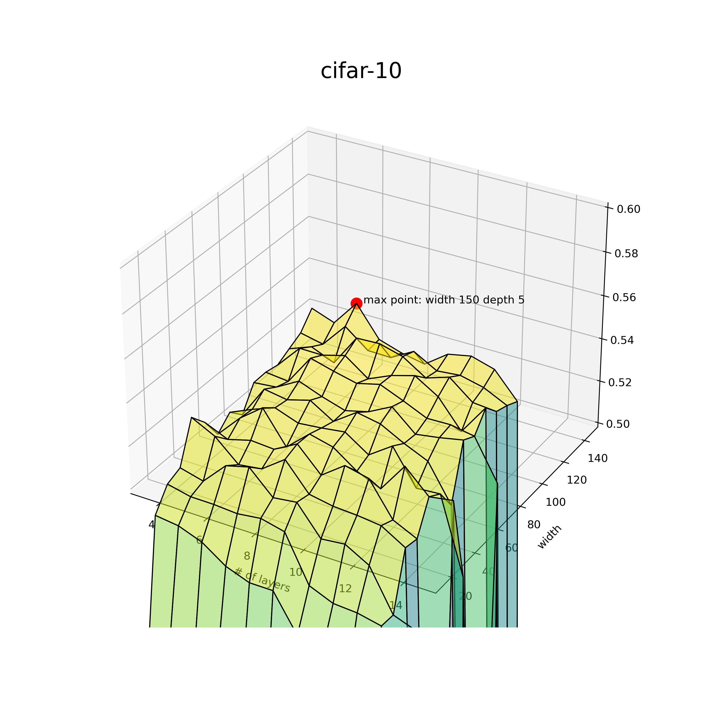

# Deep Learning study
## week1 - basic Neural Network

 가장 기본적인 linear layer만을 이용한 neural network를 사용했다. 
 이번 브랜치에서는 모델의 너비와 깊이가 어떤 영향을 갖는지 개략적으로만 알아본다.
 * dataset: MNIST, CIFAR-10
 * depth:	3 - 15 (layers)
 * width: 10 - 150 (nodes; 10개 간격)
 * epochs: 30
 * learning rate: 0.0005(MNIST), 0.001(CIFAR-10)
 * batch size: 64
 
 ### MNIST
|width/depth | 3 | 4 | 5 | 6 | 7 | 8 | 9 | 10 | 11 | 12 | 13 | 14 | 15 |
| :-: | - | - | - | - | - | - | - | - | - | - | - | - | - |
|**10** |0.9234|	0.9186|	0.9242|	0.9044|	0.9057|	0.8942|	0.8996|	0.8665|	0.8605|	0.8547|	0.6875|	0.1135|	0.1135|
|**20** |0.9477|	0.9486|	0.9448|	0.9425|	0.9244|	0.9272|	0.9433|	0.9208|	0.9359|	0.9215|	0.9328|	0.9312|	0.1135|
|**30** |0.961	|0.9619	|0.9623	|0.9479	|0.9498	|0.9544	|0.9497	|0.9379	|0.9405	|0.9421|	0.9344|	0.9403|	0.1135|
|**40** |0.9685|	0.9661|	0.9668|	0.9695|	0.9557|	0.9648|	0.9633|	0.9624|	0.9571|	0.95|	0.9444|	0.9355|	0.1135|
|**50** |0.9685|	0.9707|	0.9697|	0.9681|	0.9672|	0.9663|	0.9697|	0.9679|	0.9694|	0.9595|	0.955|	0.1135|	0.1135|
|**60** |0.9706|	0.9721|	0.9715|	0.9739|	0.9722|	0.9727|	0.9693|	0.9667|	0.9651	|0.9578	|0.9495	|0.1135	|0.1135|
|**70** |0.974	|0.9769	|0.9702	|0.9675	|0.9747	|0.9738 |0.9686	|0.9715	|0.9719	|0.9458|	0.9614|	0.1135|	0.1135|
|**80** |0.9734|	0.9733|	0.976	|0.9753	|0.9738	|0.975	|0.9711	|0.9733	|0.9699|	0.9647|	0.964|	0.1135|	0.1135|
|**90** |0.9743|	0.9766|	0.9725|	0.9753|	0.9749|	0.9785|	0.9757|	0.9714|	0.9703	|0.9695	|0.9677	|0.1135	|0.1135|
|**100** |0.9766|	0.9762|	0.9766|	0.971	|0.975	|0.9731	|0.9746	|0.9746	|0.9748	|0.9713|	0.9429|	0.1135|	0.1135|
|**110** |0.9766|	0.9778|	0.9732|	0.9761|	0.9765|	0.9765|	0.9742|	0.9738	|0.974	|0.973	|0.9644	|0.1135	|0.1135|
|**120** |0.9782|	0.9742|	0.9782|	0.9786|	0.977	|0.9783	|0.9775	|0.9745	|0.9711	|0.9767	|0.9698	|0.1135	|0.1135|
|**130** |0.9787|	0.9739|	0.9768|	0.9795|	0.9776|	0.9769|	0.9766|	0.9692|	0.9734	|0.9712|	0.9664	|0.1135|	0.1135|
|**140** |0.9782|	0.9746|	0.9794|	0.9698|	0.9793|	0.9778|	0.98	|0.9793	|0.9678	|0.9715	|0.9714	|0.1135	|0.1135|
|**150** |0.9757|	0.9804|	0.9734|	0.9794|	0.9771|	0.9715|	0.9779|	0.9749|	0.9722	|0.9744	|0.9671|	0.1135|	0.1135|

 
 
 ### CIFAR-10
 |width/depth | 3 | 4 | 5 | 6 | 7 | 8 | 9 | 10 | 11 | 12 | 13 | 14 | 15 |
| :-: | - | - | - | - | - | - | - | - | - | - | - | - | - |
|**10** |0.4171|	0.428|	0.4185|	0.4192|	0.4055|	0.3887|	0.385|	0.371|	0.348|	0.3645|	0.1|	0.1|	0.1|
|**20** |0.4815|	0.4801|	0.4759|	0.468|	0.4638|	0.4638|	0.4459|	0.4398|	0.4241|	0.4177|	0.1|	0.1|	0.1
|**30** |0.4912|	0.4887|	0.4886|	0.4878|	0.4892|	0.4865|	0.4644|	0.4596|	0.4589|	0.4565|	0.1|	0.1|	0.1
|**40** |0.4938|	0.4909|	0.5018|	0.5047|	0.4937|	0.4951|	0.4813|	0.4825	|0.4761	|0.456	|0.4518|	0.4545|	0.1
|**50** |0.5128|	0.5072|	0.4971|	0.4986|	0.5066|	0.4936|	0.4915|	0.4908|	0.4895|	0.4827|	0.1|	0.1|	0.1
|**60** |0.5054|	0.5006|	0.5036|	0.5028|	0.5088|	0.4974|	0.5055|	0.5029|	0.4868|	0.4814|	0.1|	0.1|	0.1
|**70** |0.4946|	0.5058|	0.5141|	0.4987|	0.5084|	0.5056|	0.4976|	0.4927|	0.507|	0.4961|	0.4979|	0.1|	0.1
|**80** |0.5002|	0.505|	0.5091|	0.5051|	0.5062|	0.5077|	0.5002|	0.5079|	0.4913|	0.4921|	0.4554|	0.1|	0.1
|**90** |0.494|	0.5098|	0.508|	0.5111|	0.5043|	0.512|	0.5099|	0.504|	0.499|	0.4813|	0.1|	0.1|	0.1
|**100** |0.5048|	0.5059|	0.5121|	0.5079|	0.5045|	0.5073|	0.5131|	0.5033|	0.5051	|0.5074|	0.1|	0.1|	0.1
|**110** |0.505|	0.5038|	0.5183|	0.5153|	0.5127|	0.5155|	0.5109|	0.5059|	0.5062|	0.5041|	0.4848|	0.1|	0.1
|**120** |0.5037	|0.5151|	0.515|	0.518|	0.51|	0.5149|	0.5181|	0.5113|	0.4979|	0.5127|	0.1|	0.1|	0.1
|**130** |0.5069|	0.5111|	0.5065|	0.5217|	0.5222|	0.5192|	0.5121|	0.5158|	0.5069|	0.5059|	0.1|	0.1|	0.1
|**140** |0.51|	0.5076|	0.5195|	0.5109|	0.5107	|0.5169|	0.5107|	0.5118	|0.5092|	0.5038|	0.1|	0.1|	0.1
|**150** |0.5175|	0.5135|	0.5261|	0.5116|	0.5081|	0.5059|	0.514|	0.5163|	0.5131|	0.5008|	0.1|	0.1|	0.1
 
 
